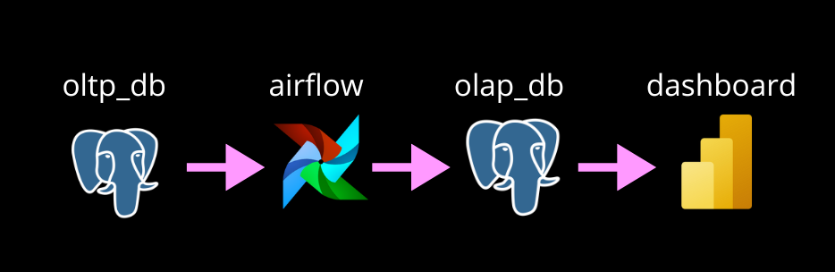
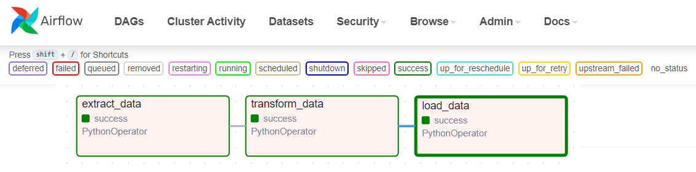

<h3>PROJETO: Desenvolvendo DAG com airflow (Em andamento)</h3>

----------------------------------------------

:heavy_check_mark:**Objetivo geral:**

Desenvolver DAG para automatizar extração de dados de tabelas OLTP , transformar e carregar em tabelas OLAP de Data Warehouse.

:heavy_check_mark:**Objetivos específicos:**

- Estudar sobre Hookes e Operators;

- Explorar mapeamento de dados;

- Estudar estrutura da DAG.

<table style="border: 1px solid black; border-collapse: collapse;">
  <tr>
    <th style="border: 1px solid black; padding: 5px;">Informação</th>
    <th style="border: 1px solid black; padding: 5px;">Detalhe</th>
  </tr>
  <tr>
    <td style="border: 1px solid black; padding: 5px;">Atividade</td>
    <td style="border: 1px solid black; padding: 5px;">Essa atividade faz parte das tarefas da disciplina de Fundamentos e projetos de BIG DATA-Modelagem Dimensional, do curso de pós-graduação em Inteligência Analítica e Ciência de dados, sob coordenação da profa. Regina Batista.</td>
  </tr>
  <tr>
    <td style="border: 1px solid black; padding: 5px;">Pós-graduação</td>
    <td style="border: 1px solid black; padding: 5px;">Inteligência Analítica e Ciência de Dados</td>
  </tr>
  <tr>
    <td style="border: 1px solid black; padding: 5px;">Centro de ensino</td>
    <td style="border: 1px solid black; padding: 5px;">UnimetroCamp Wyden</td>
  </tr>
  <tr>
    <td style="border: 1px solid black; padding: 5px;">Período</td>
    <td style="border: 1px solid black; padding: 5px;">1º semestre</td>
  </tr>
  <tr>
    <td style="border: 1px solid black; padding: 5px;">Datas</td>
    <td style="border: 1px solid black; padding: 5px;">Jun/2024 a Jun/2025</td>
  </tr>
  <tr>
    <td style="border: 1px solid black; padding: 5px;">Repositório</td>
    <td style="border: 1px solid black; padding: 5px;">Todos os trabalhos desenvolvidos durante o curso podem ser encontrados aqui: <a href="https://github.com/RegiMaria/Graduate_program_Data_Science_and_Analytical_Intelligence">Repositório da pós</a></td>
  </tr>
</table>

<h3>O PROJETO</h3>

----------------------------------------------------------------------------------------------------------------------------------

Nesse projeto vamos realizar a transferência de alguns dados de tabelas transacionais (OLTP) de uma financeira. Extraindo de um banco de dados OLTP (oltp_db) para um banco de dados OLAP (olap_dw).

Resumo:

Usamos um ambiente de desenvolvimento local para construção do pipeline.

:heavy_check_mark:**Ferramentas:**

[Airflow](https://airflow.apache.org/docs/apache-airflow/stable/installation/index.html)

[docker-compose](https://airflow.apache.org/docs/docker-stack/index.html)

[PostgreSQL ](https://www.postgresql.org/download/)

[Power BI](https://www.microsoft.com/pt-br/download/details.aspx?id=58494)

<h3>Desenvolvimento:</h3>

------------------------------------------------------------------------------------------------------------------

Vamos acessar o airflow, criar senha e admin, testamos a DAG conforme nos a modificamos.

:heavy_check_mark:**Explicando as tarefas:**

:red_circle:**Extract_data:** A extração deve extrair os dados das tabelas relacionais **oltp_db.**

A princípio, por razão de aprendizado, vamos fazer uma DAG de extração para cada tabela e não vamos usar TaskGroup. Para saber mais sobre o decorador TaskGroup consulte a [documentação.](https://airflow.apache.org/docs/apache-airflow/stable/_api/airflow/decorators/task_group/index.html) 

:red_circle:**Transform_data:** Prepara os dados para serem armazenados na tabela do banco de dados **olap_dw.**

:red_circle:**Load_data:** Carregamos os dados para o database **olap_dw** para consumo em Data Warehouse.

:pushpin:[Criando_e_populando_tabelas_relacionais](OLTP_DB)

:pushpin:[Teste_conexão_airflow_postgresql](teste)

:pushpin:[How_to](HOW_TO)

